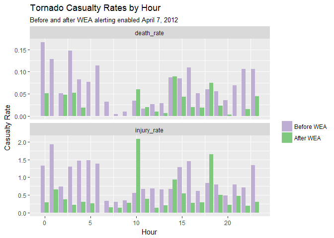
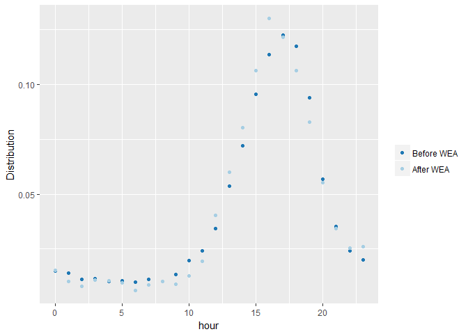
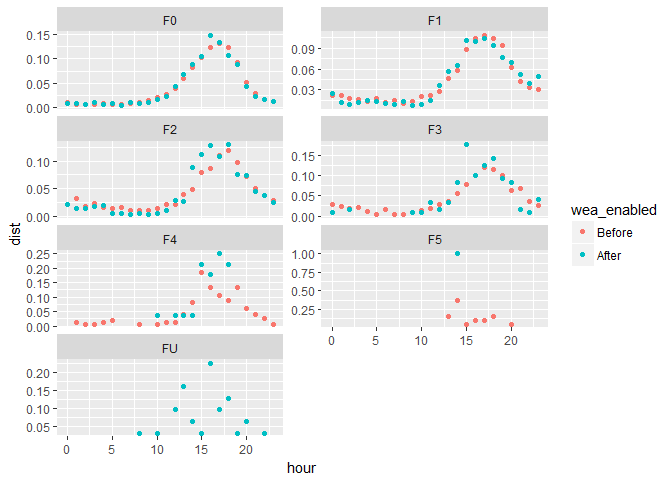

# Weather Events and WEA Messages
Aaron M. Silverman  
March 31, 2017  


# Executive Summary

On April 7,  2012, the Federal Emergency Management Agency (FEMA) began to use [Wireless Emergency Alerts (WEA)](https://www.fema.gov/frequently-asked-questions-wireless-emergency-alerts) to warn Americans of "imminent threats to life or property." These alerts consisted of 90-character messages sent by participating Cellular Mobile Service (CMS) providers over a high-priority channel to devices that were in range of specific cellular towers.

As a part of the 2006 WARN act which allowed the creation of WEA, all public television stations with Non-Commercial Educational licenses were required to pass the WEA messages from FEMA to CMS providers as a part of the normal television broadcast feed. Since 2010, the [PBS WARN project](http://pbs.org/about/warn) has designed, implemented, and maintained this diverse path for CMS providers to receive WEA messages. 

Anecdotal evidence exists that [WEA messages have saved lives in numerous situations](https://youtu.be/gC7pvCIb4-g). [WEA AMBER Alerts have been directly credited with the rescues of 38 children](http://www.missingkids.org/KeyFacts) since that program was initiated in February 2013. 

However, no systemic analysis of the data on storm-related casualties before and after WEA implementation. 

We find that the commencement of tornado and flash flood warnings delivered over WEA coincide with a significant drop in the mean number of fatalities and injuries caused by tornadoes and a 90% decrease in mean injuries caused by flash floods. Similar decreases were not seen in the 

When comparing the fatality rates of similarly-sized tornado events (based on EF Scale) before and after the availability of WEA, we find that the rate of deaths and injuries have also gone down, when outlier events are removed. 

Recently, the FCC issued [FCC 16-127, Report and Order and Notice of Proposed Rule-Making](https://www.fcc.gov/document/improving-wireless-emergency-alerts-and-community-initiated-alerting-1) which would require CMS providers to support larger messages. Although this analysis does not draw any causal relationship between the availability of WEA messages and the mean number of deaths and injuries caused by weather events, any  discussion of revisions to WEA should be informed by a thorough discussion of the current program's successes and shortcomings.

# Data 

Event information was taken from the  [NOAA](ftp://ftp.ncdc.noaa.gov/pub/data/swdi/stormevents/csvfiles/) database of storm events. The events were downloaded from NOAA immediatly prior to this report being run. 


# Effects of WEA on Weather-Related Injuries and Deaths

The first question that I would like to answer is if there has been any change in the death and/or injury rates for by flash floods and tornadoes since the National Weather Service started issuing warnings via WEA on April 7, 2012.  I use the measure of mean casualties directly caused by the particular weather event in order to control for the lower incidence of storms in the years since 2011. 

Thunderstorm wind and lightning events do not regularly trigger WEA messages, but are also caused by localized, fast-moving weather events. Although death and injury rates for these event types are historically much lower than the rates for tornado and flash flood events, we will look at rates of change for the four different event types as an extremely rough proxy for a WEA message having been issued for a specific event.  

The event is considered "Before WEA" if occurred before April 7, 2012 and "After WEA" if it occurred on or after that date.


```r
#compare tornadoes and flash floods to non-wea alerted storm events

tor_flo_wind_light <- filter(weather_event_tbl #event.damage from former version
        , type %in% c("Flash Flood", "Tornado"
                      , "Thunderstorm Wind" ,"Lightning")) %>%
    transmute(type = factor(as.character(type)
                            , levels = c("Flash Flood"
                                        , "Tornado"
                                        , "Thunderstorm Wind"
                                        ,"Lightning"))
            , begin
            , year = year(begin)
            , d_injuries = INJURIES_DIRECT
            , i_injuries = INJURIES_INDIRECT
            , d_deaths = DEATHS_DIRECT
            , i_deaths = DEATHS_INDIRECT
            , fips = paste0(st,cz)
            , fscale
            , wea_enabled = factor(
                if_else(begin >= mdy("4/7/2012")
                    , false = "Before"
                    , true = "After")
                , levels = c("Before", "After")
                , ordered = FALSE
          )
)   
twfl_yrly <- group_by(tor_flo_wind_light, type, year) %>%
  summarize(count = n()
            , deaths = sum(d_deaths)
            , death_rate = round((deaths/count),digits = 4)
            )

tfwl_sum <- group_by(tor_flo_wind_light, type) %>% 
  summarize(count = n()
            , deaths = sum(d_deaths)
            , death_rate = round((deaths/count),digits = 4)
            , injuries = sum(d_injuries)
            , injury_rate = round((injuries/count),digits = 4)
            ) 

twfl_wea_diff <- group_by(tor_flo_wind_light, type, wea_enabled) %>%
summarize(count = n()
          , deaths = sum(d_deaths)
          , death_rate = round((deaths/count),digits = 4)
          , injuries = sum(d_injuries)
          , injury_rate = round((injuries/count),digits = 4)
) 
# Gather and Spread to show stats by type before, after, and change
twfl_wea_diff %>% 
  gather(variable, amount, -type, -wea_enabled) %>%
  spread(wea_enabled, amount, convert = TRUE, sep = "_") %>%
  filter(grepl(pattern = "rate", x = variable) == TRUE) %>%
  rename(`Event Type` = type
         , Statistic = variable
         , b = wea_enabled_Before
         , a = wea_enabled_After
         ) %>%
  mutate(`% Decrease` = round((b - a) / b*100, 2)) %>%
  rename(`Before WEA` = b, `After WEA` = a) %>%
  print.data.frame()
```

```
##          Event Type   Statistic Before WEA After WEA % Decrease
## 1       Flash Flood  death_rate     0.0171    0.0184      -7.60
## 2       Flash Flood injury_rate     0.1193    0.0086      92.79
## 3           Tornado  death_rate     0.0677    0.0321      52.58
## 4           Tornado injury_rate     0.8950    0.5433      39.30
## 5 Thunderstorm Wind  death_rate     0.0018    0.0019      -5.56
## 6 Thunderstorm Wind injury_rate     0.0237    0.0128      45.99
## 7         Lightning  death_rate     0.0488    0.0616     -26.23
## 8         Lightning injury_rate     0.3108    0.2948       5.15
```

Tornadoes may have simply gotten weaker since 2012.  Grouping the storms by their strength according to the [Enhanced Fujita Scale (EF)](http://www.spc.noaa.gov/efscale/) allows us to see make an apples-to-apples comparison for death and injury rates. 


```r
# Isolate tornado events
tornadoes <- filter(weather_event_tbl, type == "Tornado") %>%
  select(id, 1:3, begin
         , d_direct = DEATHS_DIRECT
         , d_indirect = DEATHS_INDIRECT
         , i_direct = INJURIES_DIRECT
         , i_indirect = INJURIES_INDIRECT
         , fscale
         ) %>%
  mutate(year = year(begin)
         , wea_enabled = factor(
           if_else(begin >= mdy("4/7/2012")
                   , false = "Before"
                   , true = "After")
           , levels = c("Before", "After")
           , ordered = FALSE
         )
  )

tornado_deaths <- tornadoes %>% 
  group_by(year) %>% 
  summarize(count = n()
            , d_direct = sum(d_direct)
            , d_indirect = sum(d_indirect)
            , i_direct = sum(i_direct)
            , i_indirect = sum(i_indirect)
            )
  

tornado_sum_tbl <- filter(tornadoes
                          , as.numeric(fscale) >= 0) %>%
  select(year
         , deaths = d_direct
         , injuries = i_direct
         , fscale
         , wea_enabled) %>%
  group_by(fscale, wea_enabled) %>%
  summarize_at(c("deaths", "injuries"), c("mean")) %>%
  ungroup() %>%

  gather(variable, amount, -fscale, -wea_enabled) %>%
  spread(wea_enabled, amount, convert = TRUE, sep = "_") %>%
  transmute( `EF Rating` = fscale
            , Statistic = variable
            ,  `Before WEA` = round(as.numeric(wea_enabled_Before), 4)
            ,  `After WEA` = round(as.numeric(wea_enabled_After), 4)
            , `% Decrease` = round((`Before WEA` - `After WEA`)/`Before WEA`*100,2)
            ) %>%
print()
```

```
## # A tibble: 14 × 5
##    `EF Rating` Statistic `Before WEA` `After WEA` `% Decrease`
##         <fctr>     <chr>        <dbl>       <dbl>        <dbl>
## 1           F0    deaths       0.0002      0.0007      -250.00
## 2           F0  injuries       0.0174      0.0249       -43.10
## 3           F1    deaths       0.0109      0.0052        52.29
## 4           F1  injuries       0.2611      0.1347        48.41
## 5           F2    deaths       0.0913      0.0784        14.13
## 6           F2  injuries       1.9029      1.4926        21.56
## 7           F3    deaths       0.7530      0.3529        53.13
## 8           F3  injuries       9.7812      5.8908        39.77
## 9           F4    deaths       2.4800      2.0357        17.92
## 10          F4  injuries      36.1133     35.3571         2.09
## 11          F5    deaths      19.4737     24.0000       -23.24
## 12          F5  injuries     112.7368    207.0000       -83.61
## 13          FU    deaths           NA      0.0000           NA
## 14          FU  injuries           NA      0.0000           NA
```

There has only been one EF-5 tornado since 2012, the Moore, OK storm which killed 24 and injured 377.  EF-0 tornados have very low injury and fatality rates when compared to stronger storms, causing only five deaths over the 20-year period.  We see a decrease in injury and fatality rates across the remaining four levels. Perhaps EF-0 and EF-5 storms may be considered outliers?

## Overnight Warnings

A key feature of WEA, absent from other widespread alerting methods, is the ability to wake potential storm victims.  The distinct alarm that accompanies a WEA can be jarring when received in the middle of the night. A recurring detail of news stories regarding WEA is being awakened by these alarms.  

Could these anecdotes be observable in the data? 

If we compare death and injury rates for tornadoes at each hour, a sharper decrease in overnight (9pm - 7am) than daytime casualty rates may also point to WEA messages as a potential cause. 


```r
tornadoes_hourly <- transmute(tornadoes
                              , hour = hour(begin)
                              , deaths = d_direct
                              , injuries = i_direct
                              , fscale = as.numeric(str_extract(fscale, "[0-9]"))
                              , wea_enabled) %>%
  group_by(hour, wea_enabled) %>%
  summarize_at(c("deaths", "injuries", "fscale"), "mean", na.rm = TRUE) %>%
  mutate(
    death_rate = round(as.numeric(deaths), 4)
    , injury_rate = round(as.numeric(injuries), 4)
    , fscale = round(fscale, 2)) %>%
  select(hour, wea_enabled, death_rate, injury_rate, fscale)

t_h_str_distr <- transmute(tornadoes
                            , hour = hour(begin)
                            , wea_enabled
                            , fscale) %>%
  group_by(hour, wea_enabled, fscale) %>%
  summarize(events = n())

str_events_dist <- ungroup(t_h_str_distr) %>%
group_by(fscale, wea_enabled) %>%
summarize(tot_events = sum(events)) %>%
  inner_join(t_h_str_distr) %>%
  ungroup() %>%
  transmute(hour
            , fscale
            , wea_enabled
            , dist = round(events/tot_events,4)) %>%
  arrange(hour, fscale, wea_enabled)
```

```
## Joining, by = c("fscale", "wea_enabled")
```

```r
t_h_by_strength <- transmute(tornadoes
                               , hour = hour(begin)
                               , deaths = d_direct
                               , injuries = i_direct
                               , fscale
                               , wea_enabled) %>%
  group_by(hour, wea_enabled, fscale) %>%
  summarize_all(funs("mean") ) %>%
  mutate(
    death_rate = round(as.numeric(deaths), 4)
    , injury_rate = round(as.numeric(injuries), 4) ) %>%
  select(hour, wea_enabled, fscale, death_rate, injury_rate)

## Hourly distribution of tornadoes before and after WEA
##  

require(ggplot2)
require(reshape2)
```

```
## Loading required package: reshape2
```

```
## 
## Attaching package: 'reshape2'
```

```
## The following object is masked from 'package:tidyr':
## 
##     smiths
```

```r
# Hourly casualty rates

torn_hourly_plot <- melt(tornadoes_hourly
                         , id.vars = c("hour", "wea_enabled")
                         , variable.name = "casualty_type"
                         , measure.vars = c("death_rate", "injury_rate")
                         , value.name = "rate"
                         , factorsAsStrings = TRUE
)

n <- ggplot(torn_hourly_plot
            , mapping = aes(hour, rate
                            , facets = casualty_type
                            , fill = wea_enabled)
)

n + geom_bar(stat = "identity", position = "dodge") + 
  facet_wrap(facets = ~casualty_type) + 
  labs(title = "Tornado Casualty Rates by Hour"
       , subtitle = "Before and after WEA alerting enabled April 7, 2012"
       , x = "Hour"
       , y = "Casualty Rate")  +
  scale_fill_brewer(#palette = "Paired",
                    type = "qual"
                    , direction = -1
                    , breaks = waiver()
                    , name = ""
                    , labels = c("Before WEA", "After WEA")
  ) +
  facet_wrap(facets = ~casualty_type
             , ncol = 1
             , scales = "free_y") 
```

<!-- -->
We should look at the hourly distribution of storms by EF level - perhaps stronger storms occurred at different times of the day before and after April 7, 2012.


```r
tornadoes_hourly_distro <- transmute(tornadoes
                             , hour = hour(begin)
                             , wea_enabled) %>%
  group_by(hour, wea_enabled) %>%
  summarize(events = n())

t_dist_after <- filter(tornadoes_hourly_distro
                       , wea_enabled == "After") 
t_dist_after <- mutate(t_dist_after
                       ,pct_after = round(events/sum(t_dist_after$events),4))
t_dist_before <- filter(tornadoes_hourly_distro
                       , wea_enabled == "Before") 
t_dist_before <- mutate(t_dist_before
                       ,pct_before = round(events/sum(t_dist_before$events),4))


t_h_cas_bef <- filter(tornadoes_hourly, wea_enabled == "Before") %>%
  select(hour
            , dth_bef = death_rate
            , inj_bef = injury_rate)


t_h_cas_aft <- filter(tornadoes_hourly, wea_enabled == "After") %>%
  select(hour
            , dth_aft = death_rate
            , inj_aft = injury_rate)

t_dist <- inner_join(
  select(t_dist_before, hour, pct_bef = pct_before),
  select(t_dist_after, hour, pct_aft = pct_after)
) %>%
  inner_join(t_h_cas_bef) %>%
  inner_join(t_h_cas_aft) %>%
  mutate(dist_delta = round(-(pct_bef - pct_aft)/pct_bef,4)
         , dth_delt = round(-(dth_bef - dth_aft)/dth_bef,4)
         , inj_delt = round(-(inj_bef - inj_aft)/inj_bef,4)
         )
```

```
## Joining, by = "hour"
## Joining, by = "hour"
## Joining, by = "hour"
```

```r
rm()


# graph the death rate by hour before and after WEA
# hypothesis - new method of alerting will 
# lower casualty rates overnight


t_dist_plot <- melt(t_dist
                    , id.vars = "hour"
                    , variable.name = "WEA_Enabled"
                    , measure.vars = c("pct_bef", "pct_aft")
                    , value.name = "Distribution"
                    )
  
n <- ggplot(t_dist_plot, aes(hour , Distribution)) + 
     geom_point(aes(color = WEA_Enabled))

n + scale_color_brewer(palette = "Paired"
                           , type = "qual"
                           , direction = -1
                           , breaks = waiver()
                           , name = ""
                           , labels = c("Before WEA", "After WEA")
  )
```

<!-- -->

```r
# Tornado hourly distribution by strength of storm pre and post WEA
n <- ggplot(str_events_dist
            , aes(hour
                  , dist
                  , color = wea_enabled
                  , facets = fscale)
            )

n + geom_point() +
  facet_wrap(facets = ~fscale
             , ncol = 2
             , scales = "free_y") 
```

<!-- -->

```r
    scale_color_brewer(palette = "Paired"
                        , type = "qual"
                        , direction = -1
                        , breaks = waiver()
                        , name = ""
                        , labels = c("Before WEA", "After WEA")
)
```

```
## <ggproto object: Class ScaleDiscrete, Scale>
##     aesthetics: colour
##     axis_order: function
##     break_info: function
##     break_positions: function
##     breaks: waiver
##     call: call
##     clone: function
##     dimension: function
##     drop: TRUE
##     expand: waiver
##     get_breaks: function
##     get_breaks_minor: function
##     get_labels: function
##     get_limits: function
##     guide: legend
##     is_discrete: function
##     is_empty: function
##     labels: Before WEA After WEA
##     limits: NULL
##     make_sec_title: function
##     make_title: function
##     map: function
##     map_df: function
##     n.breaks.cache: NULL
##     na.translate: TRUE
##     na.value: NA
##     name: 
##     palette: function
##     palette.cache: NULL
##     position: left
##     range: <ggproto object: Class RangeDiscrete, Range>
##         range: NULL
##         reset: function
##         train: function
##         super:  <ggproto object: Class RangeDiscrete, Range>
##     reset: function
##     scale_name: brewer
##     train: function
##     train_df: function
##     transform: function
##     transform_df: function
##     super:  <ggproto object: Class ScaleDiscrete, Scale>
```
We can see that storms of similar strength occurred at similar times of day before and after WEA.  

This data strongly suggests that tornadoes were much less injurious overnight after the availability of WEA tornado alerts. 

# Conclusions:

On average, similarly sized tornadoes caused, on average, fewer deaths and injuries after WEA messages began to be sent. Flash floods also caused, on average fewer injuries after WEA messages began tobe delivered. 

Although we are not able to draw a causal relationship between the use of WEA alerts by the NWS and the lowered casualty rate for these types of events; we can,  however, see that fast-moving, localized weather events for which the NWS did not use WEA messages (lightning strikes and thunderstorm winds), did not experience similar decreases in casualty rates after April 7, 2012. 

Although they were also the frequent subject of WEA messages, the death rate for flash floods did not decrease after WEA alerting. One possible cause may be suggested by a study which uses brain mapping to conclude that, "The perceived urgency of floods also appears to be more sensitive to the personality characteristics of individuals than during other types of disasters." [Modeling Cognitive Response to Wireless Emergency Alerts to Inform Emergency Response Interventions PNNL-25257](https://www.dhs.gov/publication/wea-modeling-cognitive-response-wea-inform-emergency-response-interventions).  

Further investigation into the effect of WEA messages on population health could involve tying specific alerts sent out via WEA to the injuries and fatalities caused by those storm events. 
